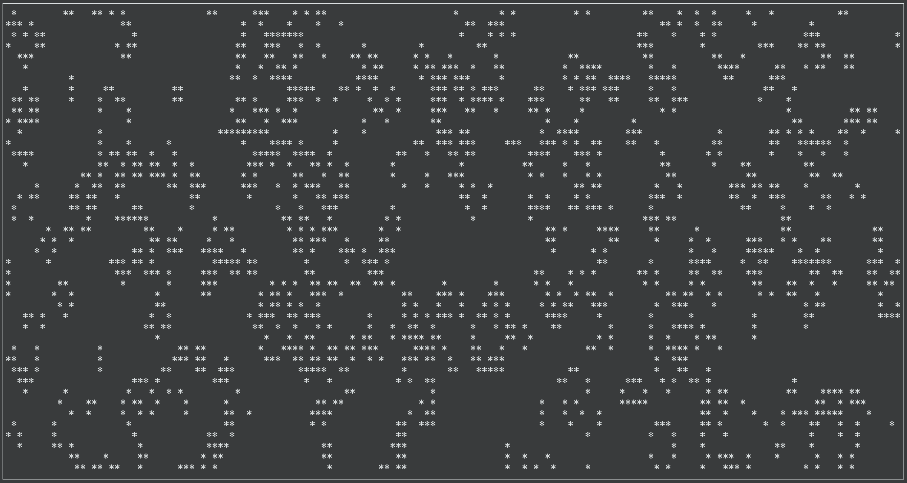

# kotlin-life
Conway's Game of Life, in Kotlin.



This is a [Kotlin](https://kotlinlang.org/) implementation of my [Rust implementation](https://github.com/joeygibson/rust-life)
of [Conway's Game of Life](http://en.wikipedia.org/wiki/Conway%27s_game_of_life). It runs
in a terminal window, using `ncurses` for drawing.

## Building
Running `./gradle shadowJar` will generate `build/libs/kotlin-life-all.jar`.

## Running
You can just run it by running `gradle run`, or using `java -jar build/libs/kotlin-life-all.jar`

The full set of options are these

```bash
Usage: kotlin-life [OPTIONS]

Options:
  -c, --columns INT      number of columns of board (default: full screen)
  -r, --rows INT         number of rows of board (default: full screen)
  -i, --iterations INT   # of iterations
  -H, --hacker           seed with the hacker emblem
  -w, --wait INT         milliseconds to sleep between iterations (default:
                         500)
  -f, --foreground TEXT  foregound color: black, red, green, yellow, blue,
                         magenta, cyan, white [default]
  -b, --background TEXT  background color: black [default], red, green,
                         yellow, blue, magenta, cyan, white
  -h, --help             Show this message and exit
```
Once running, press any key to exit.

